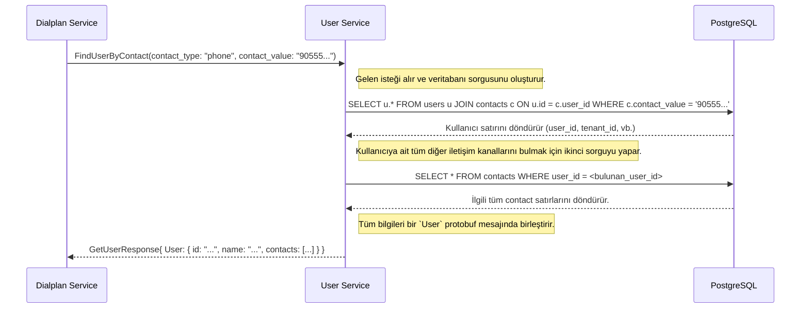

# 👤 Sentiric User Service - Mantık ve Akış Mimarisi

**Belge Amacı:** Bu doküman, `user-service`'in Sentiric platformunun **merkezi kimlik doğrulama ve varlık yönetimi otoritesi** olarak stratejik rolünü, temel veri modelini ve diğer servislerle olan etkileşim akışını açıklar.

---

## 1. Stratejik Rol: "Tek Doğruluk Kaynağı" (Single Source of Truth)

Bu servis, "Bu kişi kim?" ve "Bu kiracı kim?" sorularının platformdaki tek ve nihai cevabıdır. Tüm kullanıcı, arayan ve kiracı (`tenant`) bilgileri burada yönetilir.

**Bu servis sayesinde platform:**
1.  **Omnichannel Uyumlu Olur:** Bir kullanıcı, hem telefon numarasından (`contacts` tablosu) hem de WhatsApp ID'sinden (`contacts` tablosu) aynı `user` profiline bağlanabilir. Bu, kanallar arası tutarlı bir deneyim sağlar.
2.  **Güvenli Olur:** Diğer servisler (`dialplan`, `agent` vb.) doğrudan veritabanına erişmek yerine, bu servisin sunduğu kontrollü ve doğrulanmış gRPC arayüzü üzerinden kullanıcı verilerine erişir.
3.  **Yönetilebilir Olur:** `dashboard-ui` gibi yönetim araçları, tüm kullanıcı ve kiracı işlemlerini tek bir merkezden (bu servis üzerinden) yürütebilir.

---

## 2. Temel Veri Modeli ve Çalışma Prensibi

Servis, üç ana tablo etrafında şekillenir: `tenants`, `users`, ve `contacts`.

*   **`tenants`:** Platformu kullanan her bir müşteriyi (örn: "Sentiric Health", "Sentiric Travel") temsil eder.
*   **`users`:** Bir `tenant`'a bağlı olan her bir bireyi (bir arayan, bir ajan, bir yönetici) temsil eder. Benzersiz bir `UUID` ile tanımlanır.
*   **`contacts`:** Bir `user`'ın sahip olabileceği iletişim kanallarını (telefon, e-posta, whatsapp_id) tutar.

**Çalışma Prensibi:** Servis, dışarıya bir gRPC arayüzü sunar. Diğer servisler, bu arayüzü kullanarak kullanıcıları iletişim bilgileriyle (`FindUserByContact`) veya ID'leriyle (`GetUser`) arayabilir, yeni kullanıcılar oluşturabilir (`CreateUser`). Tüm veritabanı işlemleri bu servisin içinde soyutlanır.

---

## 3. Uçtan Uca Etkileşim Akışı: Bir Arayanın Tanımlanması

`dialplan-service`'in bir arayanı tanımlamak için `user-service`'i nasıl kullandığını gösteren akış:

